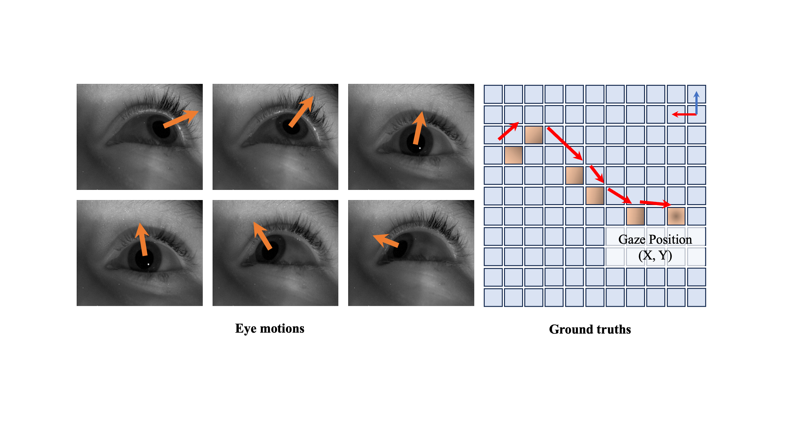

<div align="center">
  <h1 align="center"><strong>Denoising Distillation Makes Event-Frame Transformers as Accurate Gaze Trackers</strong></h1>
    <p align="center">
    <a>Jiading Li</a><sup>1</sup>&nbsp;&nbsp;
    <a>Zhiyu Zhu</a><sup>1</sup>&nbsp;&nbsp;
    <a>Jinhui Hou</a><sup>1</sup>&nbsp;&nbsp;
    <a>Junhui Hou</a><sup>1</sup>&nbsp;&nbsp;
    <a>Jinjian Wu</a><sup>2</sup>
    <br>
    <sup>1</sup>City University of Hong Kong&nbsp;&nbsp;&nbsp;
    <sup>2</sup>Xidian University&nbsp;&nbsp;&nbsp;
</div>

<div align="center">
  <h3 align="center">The source code of the paper "Denoising Distillation Makes Event-Frame Transformers as Accurate Gaze Trackers"</h3>
</div>

## Overview


We delve into the potential of utilizing pre-trained vision Transformers for cross-modal eye tracking, building upon their proven competence in capturing complex spatial-temporal relationships within multi-modal event-frame dataset. Our framework emphasizes the modeling of gaze shifts from a baseline calibration state, serving as an anchor, to the dynamically acquired state captured during actual use. Specificly, our approach ingests input in the form of a frame coupled with corresponding event data, meticulously aligned to highlight the visible region. The system is designed to scrutinize the discernible ocular zones, subsequently inferring the directional gaze vector as the output. Beyond the confines of static frame-based gaze estimation, the study of dynamic ocular movements constitutes an additional research trajectory within computer vision.


## Methodology


We first partition the whole dataset into several sub-regions, wherein each region's data is trained to cultivate a local expert network. Each expert network is simultaneously fed with the anchor state and a search state and utilize the transformers to explicitly model the correlation between the anchor and states. Subsequently, a latent-denoising knowledge distillation method is introduced to amalgamate the expertise of these several local expert networks into a singular, comprehensive student network. Note that the latent denoising and knowledge distillation are utilized in the training phase only.


## Visualization
### Static points
<div align="center">
  
</div>


### Free points
<div align="center">
  
</div>


## Getting Started

Clone the repository locally:

```
pip install+git https://github.com/jdjdli/Denoise_distill_EF_gazetracker.git
```

Create and activate a conda environment and install the required packages:

```

```


## Training
4 GPUs
```
CUDA_VISIBLE_DEVICES=0,1,2,3 torchrun --nproc_per_node=4 --master_port 8849 train_multiGPU.py
```


## Citing
```
```
