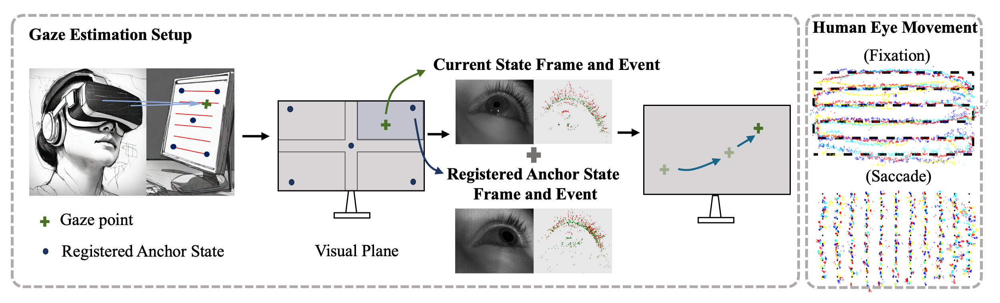

<div align="center">
  <h1 align="center"><strong>Modeling State Shifting via Local-Global Distillation for Event-Frame Gaze Tracking</strong></h1>
    <p align="center">
    <a>Jiading Li</a><sup>1</sup>&nbsp;&nbsp;
    <a>Zhiyu Zhu</a><sup>1</sup>&nbsp;&nbsp;
    <a>Jinhui Hou</a><sup>1</sup>&nbsp;&nbsp;
    <a>Junhui Hou</a><sup>1</sup>&nbsp;&nbsp;
    <a>Jinjian Wu</a><sup>2</sup>
    <br>
    <sup>1</sup>City University of Hong Kong&nbsp;&nbsp;&nbsp;
    <sup>2</sup>Xidian University&nbsp;&nbsp;&nbsp;
</div>

<div align="center">
  <h3 align="center">The source code of the paper "Modeling State Shifting via Local-Global Distillation for Event-Frame Gaze Tracking"</h3>
</div>

## Overview

<div align="center">
  
</div>

We propose a novel gaze estimation transformer framework that revolutionizes gaze tracking by leveraging the complementary strengths of event cameras and traditional frame-based imaging. Though synergizing the high temporal resolution of event data with the rich spatial information of frames via a local-global distillation process, our method achieves a new level of performance in gaze tracking. Technically, we reformulate the gaze estimation as the quantification of eye motion transitions from the current state to several prior registered anchor states. Based on this, we initially partition the entire gaze points region into several sub-regions and employ the vision transformers to pre-train a set of models on different sub-regions, yielding several local expert networks with relatively high accuracy for localized gaze estimation. Furthermore, we introduce a local-global latent denoising distillation method to distill knowledge from the set of local expert networks to a global student network to diminish the adverse effects of inherent noise from event data on student network performance. 


## Methodology


Gaze tracking aims to determine the gaze location, given the measured state. However, the high speed of eye movement and the subtle pattern of the eyeball make it hard to derive accurate predictions. Inspired by the high-temporal resolution and low-latency characteristics of event-based vision, we propose to utilize frames together with event data for building an accurate near-eye gaze estimation pipeline.

Specifically, due to the different individual biometric characteristics, e.g., pupil distance and size of the eyeball, there would be a significant bias in the gaze estimation process. Consequently, instead of directly calculating the absolute location of gaze focus from a single observational state, we propose to calculate the relative shift of the measured state compared with pre-registered anchor states. Moreover, to learn the correlation between those two states in an end-to-end manner, we delve into the potential of utilizing pre-trained vision transformers for cross-modal eye tracking. However, directly training the gaze estimation network in a large region usually leads to overfitting phenomena. Thus, we train a set of sub-region gaze estimation models for different anchor states, which are called local expert networks. 

Subsequently, to further boost the capacity for accurate gaze prediction across diverse scenarios, we design a distillation-based algorithm to ensemble knowledge of pre-trained local expert networks into a large student network. However, the presence of noise in the measured inputs (especially for the event data) can disrupt neural network training and negatively impact performance. To alleviate the potential noise influencing the neural network training, we propose a self-supervised latent denoising neural network for feature maps from experts and then apply knowledge distillation to the student network. 


## Visualization
### Static points
<div align="center">
  
</div>


### Free points
<div align="center">
  
</div>


## Getting Started

Clone the repository locally:

```
pip install+git https://github.com/jdjdli/Denoise_distill_EF_gazetracker.git
```


## Training
4 GPUs
```
CUDA_VISIBLE_DEVICES=0,1,2,3 torchrun --nproc_per_node=4 --master_port 8849 train_multiGPU.py
```


## Citing
```
@misc{li2024modelingstateshiftinglocalglobal,
      title={Modeling State Shifting via Local-Global Distillation for Event-Frame Gaze Tracking}, 
      author={Jiading Li and Zhiyu Zhu and Jinhui Hou and Junhui Hou and Jinjian Wu},
      year={2024},
      eprint={2404.00548},
      archivePrefix={arXiv},
      primaryClass={cs.CV},
      url={https://arxiv.org/abs/2404.00548}, 
}
```
